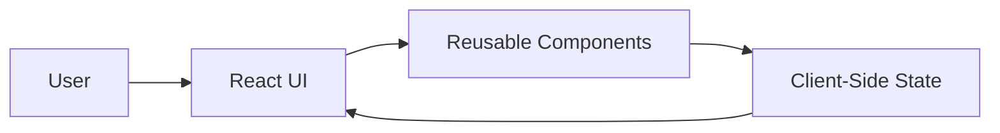

# e-PlantShopping — Modern E‑Commerce Frontend (React + Vite)

**e‑PlantShopping** is a modern, responsive **e‑commerce frontend application** built with **React** and **Vite**, focused on online plant shopping.

The project demonstrates how to build a **clean, component‑driven storefront UI**, manage client‑side state, and structure a scalable frontend codebase suitable for real‑world e‑commerce applications.

---

## What This Project Is About

e‑PlantShopping is designed as a **frontend‑first e‑commerce showcase**.

It demonstrates how to:
- build a modern React application with Vite
- design reusable UI components for product catalogs
- manage application state for cart and product data
- structure a scalable frontend project
- create a responsive shopping experience

The same approach can be applied to:
- online stores
- marketplaces
- product catalogs
- SaaS frontends

---

## Key Features

- Product catalog with plant listings
- Shopping cart functionality
- Responsive UI design
- Component‑based architecture
- Fast development build with Vite
- Clean and maintainable React code

---

## High‑Level Architecture



**Design principle:**  
UI is driven by state; components react to data changes.

---

## Frontend Structure

```
src/
  components/      Reusable UI components
  pages/           Application pages
  data/            Product data
  styles/          Styling resources
  main.jsx         Application entry point
```

This structure ensures:
- clear separation of concerns
- easy feature extension
- maintainable UI logic

---

## Technology Stack

### Core
- **JavaScript**
- **React**
- **Vite**

### UI & Styling
- **CSS**
- **Responsive layout**
- **Component‑based design**

### Tooling
- **npm**
- **ESLint**
- **Vite build system**

---

## Running the Project Locally

### Prerequisites
- Node.js (v16+ recommended)
- npm

### Install & Run
```bash
npm install
npm run dev
```

The application will be available at:
```
http://localhost:5173
```

---

## Design Principles

- Component reusability
- Clear state management
- Frontend scalability
- Performance‑oriented tooling

---

## What This Project Demonstrates

- Modern React development
- E‑commerce UI patterns
- Client‑side state handling
- Clean frontend project structuring
- Fast iteration with Vite

---

## Final Notes

e‑PlantShopping is intentionally focused on **frontend engineering quality**.

It serves as a strong foundation for extending into:
- backend integration
- payment processing
- user authentication
- full‑stack e‑commerce platforms
